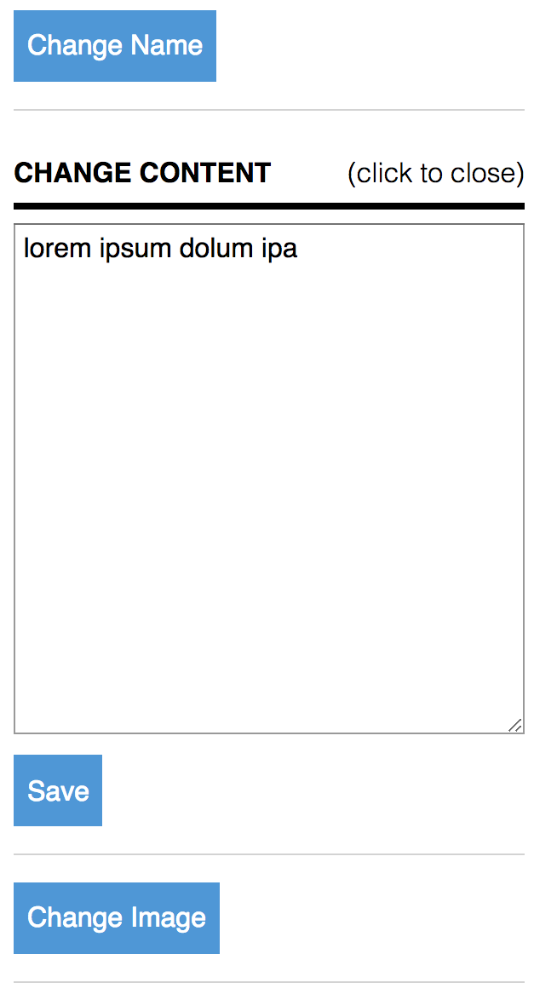

# hide and show content without javascript

> screenshot:

> code:

    

        

            
change name

            <input class='input-text' type='text' value='John Doe'/>
            <button class='btn'>save</button>
        

        

            
change content

            <textarea>lorem ipsum dolum ipa</textarea>
            <button class='btn'>save</button>
        

        

            
change image

            <input type='file'/>
            <button class='btn'>save</button>
        

    
    
